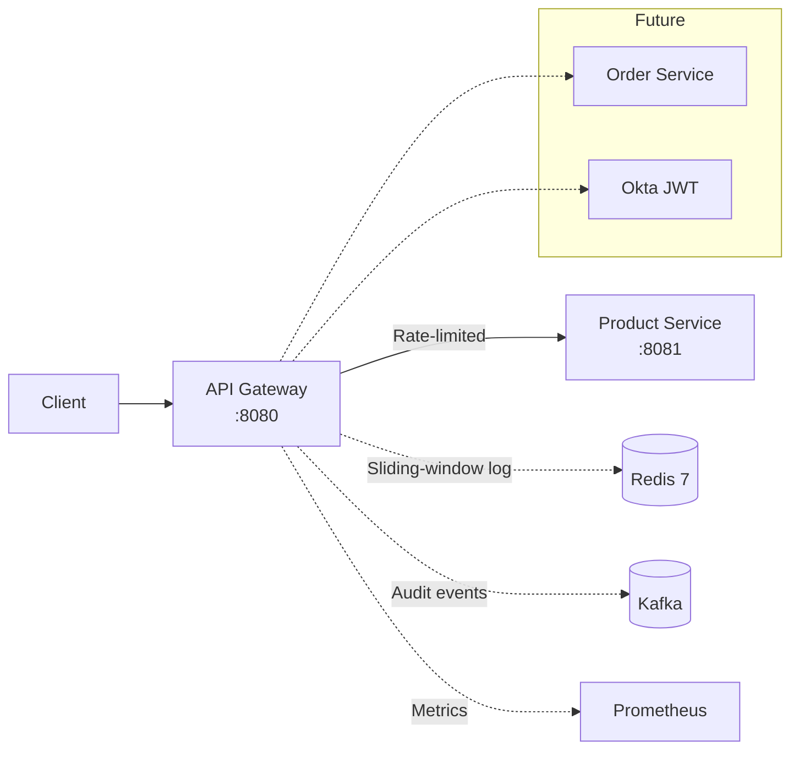

# API Gateway with Distributed Rate Limiting

[](https://github.com/vipinsharma485/api-gateway-ratelimiter/actions/workflows/ci.yml)
[](https://openjdk.org/projects/jdk/21/)
[](https://spring.io/projects/spring-boot)
[](https://redis.io/)
[](LICENSE)

> A Spring Cloud Gateway implementation exploring distributed-systems patterns at portfolio depth: in-memory → Redis sliding-window rate limiting, circuit breakers, JWT auth, Kafka event publishing, and end-to-end observability — built incrementally with each design decision documented.

> **Status:** Phases 1–4 complete — rate limiting from in-memory through an atomic Redis sliding window. See [Build Phases](#build-phases) for what's next.

---

## Why this exists

Most "API gateway" tutorials demonstrate the gateway but skip the genuinely hard part: making rate limiting work correctly across multiple gateway pods. An in-memory rate limiter looks fine locally, then breaks the moment you horizontally scale.

This repo walks through that journey honestly — starting with an in-memory implementation, surfacing its failure mode, and progressively building toward a Redis-backed sliding-window approach with atomic Lua scripts. Each architectural choice is documented as an ADR so the *reasoning* is visible, not just the code.

## Architecture



## Tech stack

| Layer | Technology |
|-------|------------|
| Language / runtime | Java 21 (LTS) |
| Gateway | Spring Cloud Gateway (reactive) |
| Downstream service | Spring Boot 4.0 (MVC) |
| Rate-limit state | Redis 7 (sliding window via Lua) |
| Event bus | Apache Kafka (429 audit events) |
| Resilience (planned) | Resilience4j circuit breaker |
| Auth (planned) | Okta OAuth2 / JWT |
| Observability (planned) | Micrometer + Prometheus + Grafana |
| Build | Maven |
| Local infra | Docker Compose |
| Deployment (planned) | Kubernetes (Helm) on AWS EKS |
| CI | GitHub Actions |

## Quickstart

**Prerequisites:** Docker, Java 21, Maven 3.9+

```bash
git clone https://github.com/vipinsharma485/api-gateway-ratelimiter
cd api-gateway-ratelimiter

# Build both services
mvn -f api-gateway/pom.xml clean package -DskipTests
mvn -f product-service/pom.xml clean package -DskipTests

# Start everything
docker compose up -d

# Verify the gateway routes to the product service
curl -i http://localhost:8080/api/products
# 200 OK with product list

# Verify the rate limiter triggers
for i in {1..15}; do
  curl -s -o /dev/null -w "Request $i: %{http_code}\n" \
    http://localhost:8080/api/products
done
# First ~10 requests: 200, then: 429 Too Many Requests
```

## Rate limiting

The gateway implements the full rate-limiting journey; the two Redis strategies key requests by client IP and return **`429 Too Many Requests`** when the limit is hit. **Phase 4's sliding window is the active production limiter.** See [ADR-0001](docs/decisions/0001-distributed-rate-limiting.md) for the full reasoning.

| Strategy | Phase | Implementation | Default | Trade-off |
|----------|-------|----------------|---------|-----------|
| In-memory token bucket | 2 | `InMemoryRateLimitFilter` | off | Per-pod state; breaks under horizontal scaling |
| Redis fixed-window counter | 3 | `RedisFixedWindowRateLimiter` + filter | off | Atomic & cheap, but allows a 2× boundary burst |
| Redis sliding-window log | 4 | `RedisSlidingWindowRateLimiter` + filter | **on** | Atomic & burst-fair; O(requests) memory per key |

The built-in Spring Cloud Gateway `RequestRateLimiter` (a Redis token bucket) is also left commented on `product-route` as a fourth reference point.

**Fixed window (Phase 3).** Counts requests per client in a fixed time bucket (`floor(now / window)`) via an atomic `INCR` + `PEXPIRE` Lua script. It is correct under concurrency, but it resets the whole quota at each bucket boundary, so a client can spend a full quota just before the boundary and another just after — up to 2× the limit. Disabled by default.

**Sliding-window log (Phase 4).** Each request is recorded in a Redis sorted set scored by timestamp. On every call a single Lua script atomically evicts entries older than the window, counts what remains, and either records the request (allow) or rejects it. Doing the whole check-and-add inside one Lua script is what makes it correct across multiple gateway replicas — there is no read-then-write gap for concurrent requests to race through. Requests are keyed by client IP.

Configuration (`api-gateway/src/main/resources/application.yaml`):

| Property | Default | Meaning |
|----------|---------|---------|
| `rate-limiter.sliding-window.enabled` | `true` | Phase 4 limiter bean + filter on/off |
| `rate-limiter.sliding-window.window-size-ms` | `60000` | Rolling window length, in milliseconds |
| `rate-limiter.sliding-window.max-requests` | `10` | Max requests per window, per client IP |
| `rate-limiter.fixed-window.enabled` | `false` | Phase 3 limiter bean + filter on/off |
| `rate-limiter.fixed-window.window-size-ms` | `60000` | Fixed window length, in milliseconds |
| `rate-limiter.fixed-window.max-requests` | `10` | Max requests per window, per client IP |

When the limit is exceeded the gateway returns **`429 Too Many Requests`** with the body `Rate limit exceeded. Try again later.` and these headers:

```
X-RateLimit-Limit: 10
X-RateLimit-Remaining: 0
Retry-After: 60
```

Enable only one limiter at a time. To run the Phase 3 fixed window instead, set `rate-limiter.fixed-window.enabled: true` and `rate-limiter.sliding-window.enabled: false`. The built-in token bucket can be restored by uncommenting the `RequestRateLimiter` filter on `product-route`.

## Build phases

This is a deliberately layered build. Each phase adds one new piece and is shipped as a set of focused commits.

| Phase | Capability | Status |
|-------|-----------|--------|
| 1 | Two-service local skeleton (gateway routes to product-service) | ✅ Done |
| 2 | In-memory rate limiter with token bucket | ✅ Done |
| 3 | Redis-backed fixed-window rate limiter (atomic INCR + EXPIRE) | ✅ Done |
| 4 | Redis sliding-window via atomic Lua script | ✅ Done |
| 5 | Resilience4j circuit breakers on downstream calls | ⬜ |
| 6 | Distributed tracing with OpenTelemetry + Jaeger | ⬜ |
| 7 | Prometheus metrics + Grafana dashboard | ⬜ |
| 8 | Kafka audit-event publishing (outbox pattern) | ⬜ |
| 9 | JWT validation via Okta JWKS | ⬜ |
| 10 | Helm chart + local Kubernetes (kind) deployment | ⬜ |
| 11 | Terraform module: VPC + EKS + ElastiCache | ⬜ |
| 12 | GitHub Actions CD to AWS EKS | ⬜ |
| 13 | Order Service (second downstream) | ⬜ |
| 14 | Idempotency keys on write endpoints | ⬜ |
| 15 | Load test harness (k6) with documented results | ⬜ |

## Design decisions

Architectural decisions are recorded as ADRs in [`docs/decisions/`](docs/decisions/).

| # | Decision | Status |
|---|----------|--------|
| [0001](docs/decisions/0001-distributed-rate-limiting.md) | Distributed rate limiting via Redis sliding window | Accepted — updated with Phase 4 |

## Project structure

```
.
├── api-gateway/            # Spring Cloud Gateway (reactive)
│   ├── src/
│   └── pom.xml
├── product-service/        # Spring Boot MVC downstream service
│   ├── src/
│   └── pom.xml
├── docs/
│   └── decisions/          # Architecture Decision Records (ADRs)
├── .github/
│   └── workflows/
│       └── ci.yml          # Build + test on every push
├── docker-compose.yaml
└── README.md
```

## Contributing / Feedback

This is a personal portfolio project, but feedback is genuinely welcome — open an issue if you spot something off in an ADR or in the implementation.

## License

[Apache 2.0](LICENSE)
